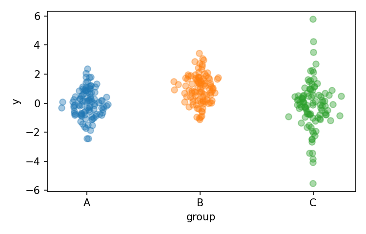

# postaplot

POSTA (Presentation Of Sincere Total Adquisitions) plots provide *kernel-density aware scatter plots* with a seaborn-like API.  
Each point is jittered horizontally according to the estimated density at its vertical position, so the cloud of points approximates the underlying distribution when a lot of observations are availabe, and functios as a regular strip or swarm plot with few points, making it a good default plot type.



## Installation

```bash
pip install -e .
```

Requires Python ≥3.8, and depends on `numpy`, `scipy`, `matplotlib`, `pandas`.

## Quickstart

```python
import matplotlib.pyplot as plt
import pandas as pd
import numpy as np
import postaplot

df = pd.DataFrame({
    "group": np.repeat(["A","B","C"], 100),
    "y": np.r_[np.random.normal(0,1,100),
               np.random.normal(1,1,100),
               np.random.standard_t(4,100)]
})

fig, ax = plt.subplots()
postaplot.kde_scatter(df, x="group", y="y", ax=ax, seed=0)
plt.show()
```

---

## Features

* KDE-based jitter → point cloud approximates density.
* **Discrete or continuous `hue`**

  * discrete → legend
  * continuous → colorbar
* **Dodge** discrete subgroups into separate sub-clouds.
* Flexible marker styling:

  * aliases: `ms`, `mfc`, `mec`, `mew` work like in `plot()`.
  * `hollow=True` for edge-only markers.
* User-facing API: `kde_scatter`
* Low-level engine: `kde_scatter_engine` (returns `PathCollection`).

---

## Documentation

See the [Cookbook](docs/cookbook.md) for examples:

* Normal vs uniform jitter
* Discrete vs continuous hue
* Hollow markers (edge-colored by hue)
* Custom edge vs face colors
* Dodging multiple groups
* Colorbars and legends

---

## License

MIT
