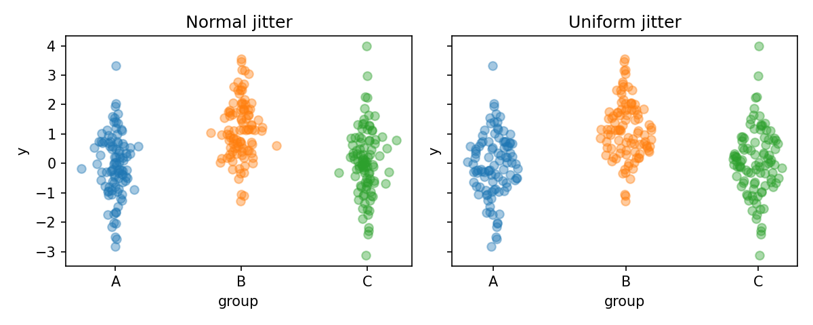
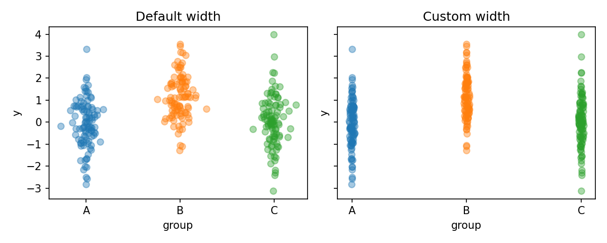
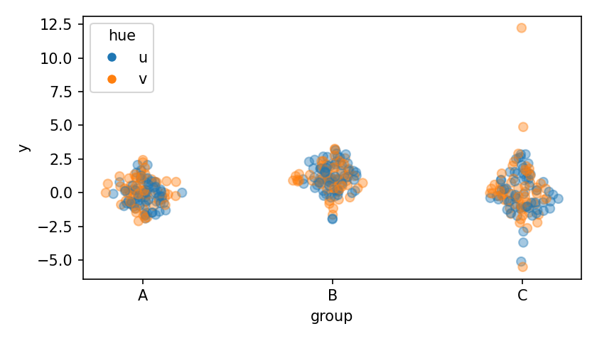
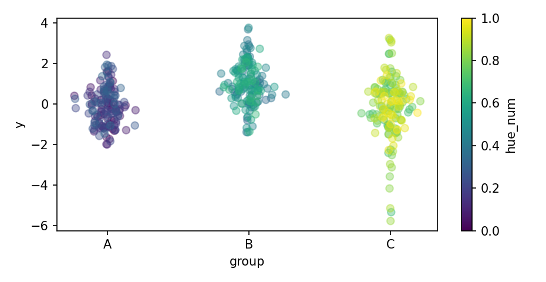
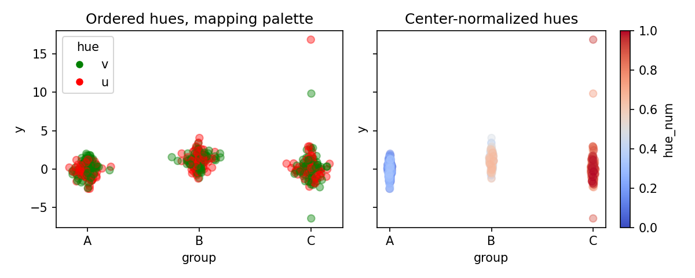
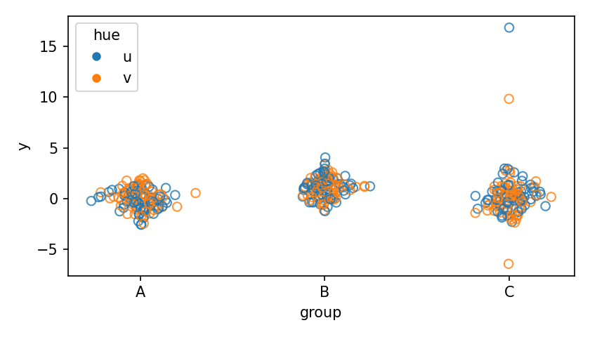
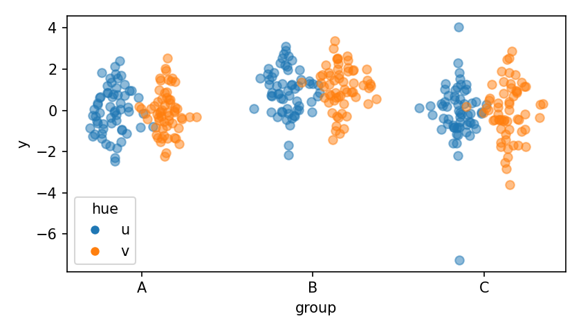
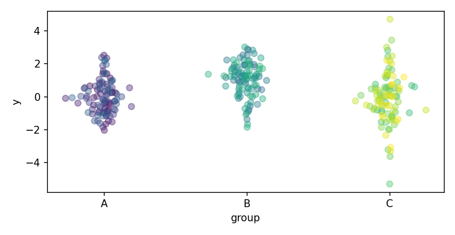
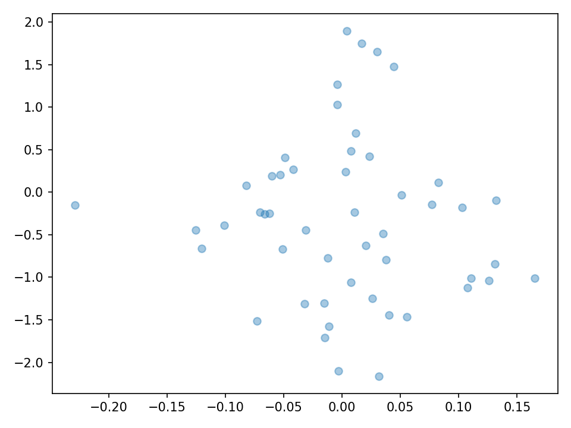
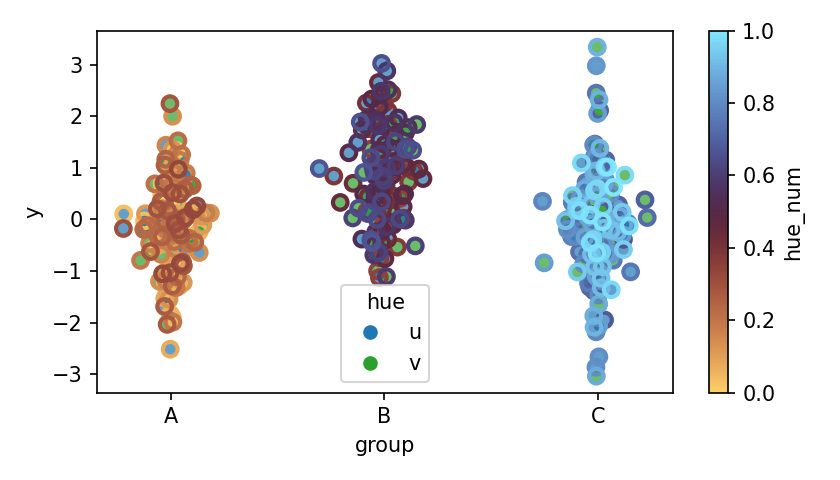

# postaplot Cookbook

This cookbook shows how to use `postaplot.psotaplot` in common and advanced scenarios.

---

## 1. Basic plot

```python
import pandas as pd, numpy as np, matplotlib.pyplot as plt
import postaplot

df = pd.DataFrame({
    "group": np.repeat(["A","B","C"], 100),
    "y": np.r_[np.random.normal(0,1,100),
               np.random.normal(1,1,100),
               np.random.standard_t(4,100)]
})

fig, ax = plt.subplots()
postaplot.postaplot(df, x="group", y="y", ax=ax)
```


---

## 2. Normal vs uniform jitter

```python
fig, axs = plt.subplots(1, 2, figsize=(8,4))
postaplot.postaplot(df, x="group", y="y", ax=axs[0], width_distr="normal", seed=1)
axs[0].set_title("Normal jitter")

postaplot.postaplot(df, x="group", y="y", ax=axs[1], width_distr="uniform", seed=1)
axs[1].set_title("Uniform jitter")
```



---

## 3. Control jitter width

```python
fig, axs = plt.subplots(1, 2, figsize=(8,4))
postaplot.postaplot(df, x="group", y="y", ax=axs[0], width_distr="normal", seed=1)
axs[0].set_title("Default width")

postaplot.postaplot(df, x="group", y="y", ax=axs[1], width_distr="uniform", seed=1, horizontal_scale=0.05)
axs[1].set_title("Custom width")
```



For normal jitter, the cloud appears around 4×`horizontal_scale`.

---

## 4. Discrete hue (legend)

```python
df["hue"] = np.tile(["u","v"], len(df)//2)
fig, ax = plt.subplots()
postaplot.postaplot(df, x="group", y="y", hue="hue", ax=ax, reference=True)
```



---

## 5. Continuous hue (colorbar)

```python
df["hue_num"] = np.linspace(0, 1, len(df))
fig, ax = plt.subplots()
postaplot.postaplot(df, x="group", y="y", hue="hue_num", ax=ax, reference="auto")
```



---

## 6. Hue customization

```python
fig, axs = plt.subplots(1, 2, figsize=(8,4))
postaplot.postaplot(df, x="group", y="y", hue="hue", ax=axs[0], width_distr="normal", seed=1,
hue_order=['v', 'u'], palette={'u':'r', 'v':'g'})
axs[0].set_title("Ordered hues, mapping palette")

postaplot.postaplot(df, x="group", y="y", hue="hue_num", ax=axs[1], width_distr="uniform", seed=1, horizontal_scale=0.05, hue_norm=colors.CenteredNorm(vcenter=0.5), palette='coolwarm')
axs[1].set_title("Center-normalized hues")
```



---

## 7. Hollow markers

```python
fig, ax = plt.subplots()
postaplot.postaplot(
    df, x="group", y="y", hue="hue", dodge=False,
    ax=ax, hollow=True, markersize=6, alpha=0.8
)
```



Hue now colors the **edges** of the markers; faces are transparent.


---

## 8. Dodging sub-groups

```python
fig, ax = plt.subplots()
postaplot.postaplot(
    df, x="group", y="y", hue="hue", dodge=True,
    ax=ax, alpha=0.5
)
```



Each subgroup within a category gets its own offset cloud.

---

## 9. Supress legend or colorbar

Control reference rendering:

```python
postaplot.postaplot(df, x="group", y="y", hue="hue_num", reference=False)
```



---

## 10. Low-level engine

```python
from postaplot import postaplot_engine

fig, ax = plt.subplots()
y = np.random.normal(size=50)
coll = postaplot_engine(loc=0, series=y, ax=ax, seed=0)
print(type(coll))
# matplotlib.collections.PathCollection
```



Useful when you want full control over axes and legends yourself.

---

## 11. Separate edge and face colors

This is not natively supported, so you need a workaround. Either plot twice, using seed to make both clouds the overlap:

```python
fig, ax = plt.subplots()
# plot point faces
postaplot.postaplot(
    df, x="group", y="y", hue='hue',
    mec='none', palette={'u':"tab:blue", 'v':"tab:green"},
    markersize=7, alpha=0.7, seed=seed
)
# plot point edges
postaplot.postaplot(
    df, x="group", y="y", hue='hue_num',
    mfc='none', palette='managua', mew=2,
    markersize=7, alpha=1, seed=seed
)
```



or use the low level `postaplot_engine` to pass color arrays to `edgecolors` or `facecolors` manually. This will require producing the legend, colormap and axis labels manually, but generates a single path collection.

```python
# add edgecolors to df
norm = colors.Normalize(df['hue_num'].min(), df['hue_num'].max())
edgecolors = mpl.colormaps['managua'](norm(df['hue_num'].to_numpy()))
df['ec'] = [tuple(colors) for colors in edgecolors]

# plot each group separately
fig, ax = plt.subplots()
rng = np.random.default_rng(seed)
for loc, (name, g) in enumerate(df.groupby("group")):

    fc = g['hue'].map({'u':'tab:blue', 'v':'tab:green'}).to_numpy()
    ec = g['ec'].to_numpy()
    postaplot_engine(loc=loc, series=g.y, ax=ax, color=fc, edgecolors=ec,
                     alpha=1, rng=rng, ms=7, mew=2)

# cleanup
del df['ec']
```